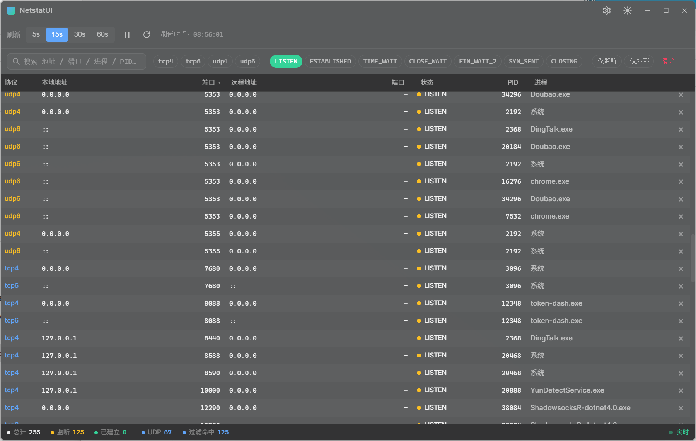
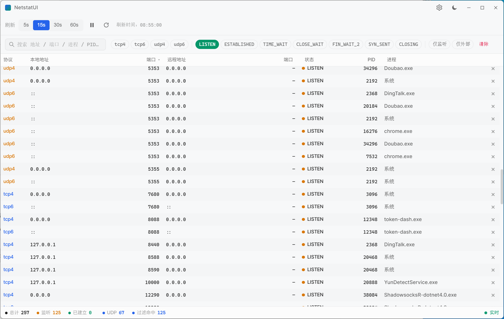

# NetstatUI

> 系统原生 `netstat` 命令的图形化桌面界面。

[English](./README.md) · [简体中文](./README.zh-CN.md)

NetstatUI 把操作系统自带的 `netstat` 机制 —— 套接字、端口、PID、进程 —— 封装到一个实时、可筛选、可换肤的桌面窗口里。不用背命令参数，也不用 `grep`，打开就是一个可排序的表格，右键一键结束进程、打开所在文件夹。

基于 **Wails 3** + **Vue 3**，**gopsutil/v3** 作为统一的跨平台后端。Windows、macOS、Linux 三端共用 `services/netstat/`、`services/process/`、`services/kill/` —— 差异只在各平台的实现文件。

---

## 截图

| 暗色 | 亮色 |
|:----:|:----:|
|  |  |

远程 IP 地理位置（`国家-城市`）显示在"远程地址"列右侧。开关位于 **设置 → 通用 → IP 地理位置**（`np.geo`）。

---

## 核心特性

- 🌍 **IP 地理位置** — 远程地址列直接显示 `国家-城市`（如 `中国-杭州`），基于离线 [ip2region](https://github.com/lionsoul2014/ip2region) 库；xdb 内嵌进二进制，无需联网。

- 📡 **全量可见** — 涵盖 TCP4 / TCP6 / UDP4 / UDP6，每条连接展示本地 + 远端地址、状态、PID 与解析后的进程路径。
- 🖥️ **一套代码，三端运行** — Windows 10/11、macOS 12+、Linux（WebKitGTK）。所有功能在三端完全一致。
- ⚡ **实时增量刷新** — diff 推流；首帧 `conn:full`，后续只推 `added` / `removed` / `updated`。
- 🚀 **自写虚拟滚动** — 万行级数据 60 fps 流畅渲染（绝对定位 + transform，不依赖第三方表格库）。
- 🔍 **强大筛选** — 全字段搜索、协议 chip、状态 chip、仅 LISTEN / 仅外网切换。
- 🪓 **一键结束进程** — 确认弹框 → `TerminateProcess`（Windows）/ `SIGKILL`（macOS/Linux），结束后立即自动刷新。
- 🎨 **自适应主题** — 明亮 / 暗黑 / 自动（跟随系统），Win11 22621+ 上启用 Mica 毛玻璃，密度支持紧凑 / 舒适两种。
- 🌍 **中英双语 UI** — 默认英文 / 简体中文，OS locale 自动识别。
- 💾 **设置持久化** — 主题 / 语言 / 刷新间隔 / 运行状态 / 地理位置开关全部写入 localStorage（`np.*` 前缀）。

---

## 技术栈

| 层        | 选型                                                                                            |
| --------- | ----------------------------------------------------------------------------------------------- |
| 外壳      | Wails 3 `v3.0.0-alpha.98`（Frameless + Win11 Mica；Linux 走 WebKitGTK）                          |
| 后端      | Go 1.25+ — [`gopsutil/v3`](https://github.com/shirou/gopsutil) 处理网络、进程、信号                  |
| 前端      | Vue 3 + TypeScript + Vite 8                                                                      |
| 状态      | Pinia                                                                                            |
| 国际化    | vue-i18n `@^9`（`legacy: false`）                                                               |
| 工具      | @vueuse/core `^14`                                                                               |

完整架构、数据流、不变量见 [`AGENTS.md`](./AGENTS.md)。

---

## 从源码构建

需要 **Go 1.25+**、**Node.js 20+** 以及 **Wails 3** CLI。

```bash
# 一次性
go install github.com/wailsapp/wails/v3/cmd/wails3@v3.0.0-alpha.98

# 开发模式（热重载）
wails3 dev

# 生产构建
wails3 build                  # 三端通用
# 或仅 Windows：
.\build.ps1                   # 绕过文件锁问题（见下）
```

产物路径：
- Windows: `bin/NetstatUI.exe`
- macOS / Linux: `bin/NetstatUI`

### Linux 构建依赖

`wails3 build` 在 Linux 上需要 WebKitGTK + GTK 3：

```bash
sudo apt-get install -y libgtk-3-dev libwebkit2gtk-4.1-dev pkg-config
```

旧发行版若提供 `libwebkit2gtk-4.0`，把上面包名里的 `4.1` 改成 `4.0` 即可。

> **提示**：若 Windows 下 `wails3 build` 报 `Access is denied`，请改用 `build.ps1` —— 它强制就地生成 TS bindings，跳过 SearchIndexer / Defender 持锁的 `RemoveAll+Rename` 步骤。

---

## 使用说明

1. 启动 `NetstatUI`。
2. 表格展示所有活动连接，底部 **StatsBar** 汇总总数 / LISTEN / ESTABLISHED / UDP。
3. **FilterBar** —— 按协议、状态筛选，或输入搜索关键字（匹配所有可见列）。
4. **Toolbar** —— 选择刷新间隔（5 / 15 / 30 / 60 秒），暂停 / 继续，或点击刷新按钮立即拉取一次。
5. 单击行打开 **DetailPanel**（完整进程信息 + 打开所在文件夹）。
6. 右键弹出上下文菜单 —— **结束进程** 会弹出确认弹框。

### Windows 首次运行（SmartScreen 警告）

发布的 `NetstatUI.exe` **未使用付费证书签名**（EV/OV 代码签名证书年费 $300–500，本项目目前免费分发），因此 Windows 10/11 在全新机器上首次启动时会弹一个 **Microsoft Defender SmartScreen** 警告：

> "Windows 已保护你的电脑 — Microsoft Defender SmartScreen 阻止了无法识别的应用启动。"

这**不是病毒检测**，只是对未签名 exe 基于"信誉"的提示。运行方法：

1. 在 SmartScreen 弹框里点 **更多信息**。
2. 展开后会出现 **仍要运行** 按钮 —— 点击即可启动。

SmartScreen 会记住该 exe 的哈希值，同一台机器上再次启动**同一份** `NetstatUI.exe` 不会再弹。换成新版本又会弹一次。

如果想永久消除警告（且不花钱买证书），可以参考 [从源码构建](./README.zh-CN.md#从源码构建) 自行用 `signtool sign /a` 签名（自签名证书依然会触发 SmartScreen，但至少能显示发布者名称）。要彻底干净地发布，正式做法是申请 [DigiCert / Sectigo 的 EV 代码签名证书](https://learn.microsoft.com/zh-cn/windows/security/identity-protection/access-control/access-control)。

### macOS 首次运行（Gatekeeper 警告）

发布的 `NetstatUI` 二进制（或 `NetstatUI.app` 包里的 .app）**未使用 Apple Developer ID 签名也未做公证**（Apple 开发者计划年费 $99，本项目目前免费分发），因此 macOS 在全新机器上首次启动时会弹一个 **Gatekeeper** 警告：

> "无法打开 NetstatUI，因为无法验证开发者。"
> / "NetstatUI 来自未识别的开发者。"

这**不是病毒检测**，只是对没有 Developer ID 签名的应用的"信誉"提示。三种打开方式：

**方法 1 — Finder（GUI，推荐大多数用户）：**
1. 在 Finder 里找到 `NetstatUI`。
2. **右键**（或 Ctrl+点击）图标，菜单里选 **打开**。
3. 在新弹框里点 **打开**。

之后 macOS 会记住你的选择，以后双击就能正常打开。

**方法 2 — 系统设置（如果双击直接被拦了）：**
1. 试着打开 `NetstatUI` —— 会被 Gatekeeper 拦下。
2. 打开 **系统设置 → 隐私与安全性**。
3. 滚到下面会看到一段 "已阻止打开 NetstatUI，因为它不是来自已识别的开发者"。
4. 点 **仍要打开**，再用 Touch ID / 密码确认。

**方法 3 — 命令行一次性解除（适合终端党）：**

```bash
xattr -d com.apple.quarantine /path/to/NetstatUI
./NetstatUI
```

`xattr -d com.apple.quarantine` 会删除 macOS 给从网络下载的文件打上的 `com.apple.quarantine` 扩展属性，之后 Gatekeeper 不再拦截。（如果文件不是从浏览器 / curl 下来的，本来就没这个属性，命令会报错 —— 这种情况下用方法 1 或方法 2。）

如果想永久消除警告（且不花 $99 买开发者账号），可以自己用 `codesign --sign - NetstatUI` 做 ad-hoc 自签名（首次仍会触发 Gatekeeper，但弹框稍微没那么吓人）。要彻底干净地发布，正式做法是申请 [Apple Developer ID + 用 `notarytool` 公证](https://developer.apple.com/cn/documentation/security/notarizing_macos_software_before_distribution)。

### 设置

点击标题栏的 **⚙ Settings**：

- **通用** —— 主题（auto / light / dark）、语言（English / 简体中文）、**IP 地理位置（显示 / 隐藏）**、密度（紧凑 / 舒适）、刷新间隔。
- **高级** —— 清除 localStorage 一键重置。

---

## 平台支持

| 平台     | 状态                                                                                            |
| -------- | ----------------------------------------------------------------------------------------------- |
| Windows  | ✅ 完整 —— gopsutil 走 `GetExtendedTcpTable` / `GetExtendedUdpTable`；杀进程走 `TerminateProcess` |
| macOS    | ✅ 完整 —— gopsutil 走 `sysctl`；杀进程走 `SIGKILL`；locale 走 `osascript`                        |
| Linux    | ✅ 完整 —— gopsutil 走 `/proc/net/{tcp,udp}{,6}`；杀进程走 `SIGKILL`；locale 走 `$LANG`            |

### 平台差异

- **Windows** — Mica 毛玻璃需要 Win11 build 22621+；更早的 Windows 上窗口回退为纯色背景。首次运行的 SmartScreen 警告详见上文 [Windows 首次运行（SmartScreen 警告）](./README.zh-CN.md#windows-首次运行smartscreen-警告)。
- **macOS** — 首次启动可能弹"辅助功能 / 完全磁盘访问权限"请求（gopsutil 通过 `libproc` 读进程信息）。首次运行的 Gatekeeper 警告详见上文 [macOS 首次运行（Gatekeeper 警告）](./README.zh-CN.md#macos-首次运行gatekeeper-警告)。
- **Linux** — 非 root 用户看不到其他用户的 socket 的 PID（内核限制）；要看全部需 `sudo ./NetstatUI`。

架构是可插拔的：`services/netstat/`、`services/process/`、`services/kill/`、`services/system/` 每个都为支持的 OS 配一份 `*_<os>.go`，编译时通过 `//go:build` 标签选择。新增平台 = `netstat_<os>.go` + `process_<os>.go` + `kill_<os>.go` + `system_<os>.go` + `netstat_platform_<os>.go` + 在 `main.go` 的 `switch runtime.GOOS` 加 case。

---

## 已知限制

- **Windows 11 22H2+ 上部分 loopback listener 可能缺失** —— `iphlpapi.dll` 的 `GetTcpTable2` / `GetExtendedUdpTable` 会静默丢弃一部分 `127.0.0.1` LISTEN 连接。`netstat -ano` 用的是 WMI 路径所以能看到；本工具与 gopsutil 走相同 iphlpapi 路径，存在同样限制。
- **Mica 毛玻璃仅 Windows** — 无边框半透明窗口在 macOS / Linux 上回退为纯色背景。
- **Windows 首次运行 SmartScreen 警告** — 发布的二进制未用付费 EV/OV 证书签名；详见上文 [Windows 首次运行（SmartScreen 警告）](./README.zh-CN.md#windows-首次运行smartscreen-警告)。
- **macOS 首次运行 Gatekeeper 警告** — 发布的二进制未用 Apple Developer ID 签名也未公证；详见上文 [macOS 首次运行（Gatekeeper 警告）](./README.zh-CN.md#macos-首次运行gatekeeper-警告)。

更多见 [`AGENTS.md` → 已知坑](./AGENTS.md#已知坑)。

---

## 目录结构

```
.
├── main.go                       # Wails 入口：注册服务 + 事件 + 平台分发
├── app.go                        # AppService：KillProcess / GetProcessDetail / OpenProcessFolder / GetSystemLocale
├── services/
│   ├── netstat/                  # TCP/UDP 快照（共享适配器 + 各平台 provider）
│   │   ├── netstat_proto.go      # mapProto / mapState / gopsutilSnapshot（共享）
│   │   ├── netstat_windows.go    # gopsutil 包装
│   │   ├── netstat_darwin.go     # gopsutil 包装
│   │   └── netstat_linux.go      # gopsutil 包装
│   ├── process/                  # PID → 名称 / 路径 缓存（三端 gopsutil）
│   ├── monitor/                  # 轮询、diff、事件发射、地理查询
│   ├── geo/                      # IP → 国家-城市（ip2region xdb，内嵌）
│   ├── kill/                     # 杀进程（Win 走 TerminateProcess，Unix 走 SIGKILL，统一 gopsutil）
│   └── system/                   # GetSystemLocale（注册表 / osascript / $LANG）
├── data/                         # ip2region xdb 文件（已 gitignore，通过 scripts/download-xdb.ps1 拉取）
├── scripts/                      # download-xdb.ps1
├── frontend/
│   ├── bindings/                 # 生成物 —— wails3 generate bindings -ts
│   └── src/
│       ├── App.vue               # 布局 + 首帧 fetchSnapshot
│       ├── components/           # TitleBar, Toolbar, FilterBar, ConnectionTable, DetailPanel, ...
│       ├── composables/          # useConnections（事件订阅 + diff）, useFilters
│       ├── locales/              # en-US, zh-CN
│       └── stores/settings.ts    # Pinia（theme / locale / interval / running / density）
├── build/
│   ├── config.yml                # Wails 元信息（公司、产品、标识符）
│   ├── windows/info.json         # Windows 资源元信息
│   └── darwin/Info.plist         # macOS bundle 元信息
├── build.ps1                     # Windows 安全构建（绕过文件锁）
└── .github/workflows/build.yml   # CI：windows-amd64 + darwin-arm64（Intel macOS 通过 Rosetta 2 运行）
```

---

## 二次开发

参见 [`AGENTS.md`](./AGENTS.md)：

- 入口文件与关键不变量
- 数据流图与事件载荷说明
- 易踩坑点（字节序、IPv6 结构体偏移、首帧竞态、embed 要求）
- 扩展指南（新增列 / 筛选 / 语言 / 后端方法 / 平台）

修改 Go 服务签名后重新生成 TypeScript bindings：

```bash
wails3 generate bindings -ts -clean=false
```

---

## 许可证

MIT —— 见 [`LICENSE`](./LICENSE)。
